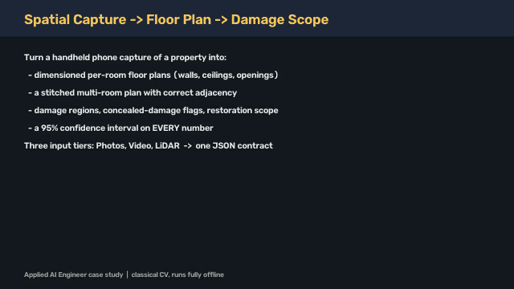

# Spatial Capture → Floor Plan → Damage Scope

Turn a handheld phone capture of a property (photos, video or LiDAR) into dimensioned, stitched floor plans with damage scope, and attach a **95% confidence interval to every number**.

## 🎬 Demo

[](docs/demo.mp4)

▶️ **[Watch the full demo video (60 s, MP4)](docs/demo.mp4)**. It covers the problem, how to run the pipeline, the input captures, the stitched plan and the measured results. Regenerate it with `python scripts/make_demo_video.py`.

<!-- To get an inline video player: edit this README on github.com, drag docs/demo.mp4 into the editor,
     and paste the generated https://github.com/user-attachments/assets/... URL on its own line here. -->


---

## 1. The problem being solved

Insurance adjusters and restoration contractors still measure damaged rooms by hand with a tape. The work is slow and error-prone, and the scope (what to repair, how much material, what it costs) depends entirely on those numbers. Consumer scan apps exist, but they report confident numbers with no idea of their own error. They also fall apart when tracking **drifts** over a multi-room walkthrough: rooms overlap, walls double up and doors stop lining up.

The pipeline takes a **consumer phone capture** and outputs:

| Output | Where |
| :-- | :-- |
| Per-room plan: wall lengths, ceiling height, floor area, doors and windows | `plan.json → rooms[]` |
| Stitched multi-room plan with correct adjacency and no overlaps | `rooms[].polygon`, `floor_plan.svg` |
| Damage regions (class plus metric extent on the wall) | `walls[].damage_regions[]` |
| Concealed-damage flags, citing the rule that fired | `concealed_damage_flags[]` |
| Restoration scope line items keyed to each surface | `scope_line_items[]` |
| A 95% CI on every measurement that widens honestly as the input gets thinner | every `{val, ci_95}` |

There are three input tiers (**Photos**, **Video** and **LiDAR**). All of them produce the same JSON contract from one command.

---

## 2. Quick start

Requires Python 3.10 or newer (tested on 3.14, Windows 11). Everything runs **offline**.

```bash
pip install -r requirements.txt

python scripts/reproduce_all.py        # dataset + pipeline + all gates + fix loop  (~40 s)
python -m benchmark.perceived_eval     # video & photo tiers from raw RGB pixels   (~50 s)
python scripts/make_demo_video.py      # docs/demo.mp4
```

### One command per capture
```bash
python -m pipeline.run --input benchmark/data/tier3_lidar_raw --tier lidar  --output results
python -m pipeline.run --input <video_capture>                --tier video  --output results
python -m pipeline.run --input <folder with one subfolder per room> --tier photos --output results

# Drift ablation: use the raw poses as recorded, no drift correction
python -m pipeline.run --input benchmark/data/tier3_lidar_raw --tier lidar --no-drift-correction --output results_off
```
Outputs are `results/plan.json` (schema in [pipeline/models.py](pipeline/models.py)) and `results/floor_plan.svg`.

### Web app
```bash
python web_ui/app.py      # open http://127.0.0.1:5000
```
Upload a capture, pick the tier, and view the rendered plan, measurements with CIs, damage flags and scope.

### Capturing your own data
- LiDAR: use the 3D Scanner App and export "All Data" (depth, poses, intrinsics).
- Video: walk through every room slowly, sweeping the camera so floor and ceiling edges are in view.
- Photos: take 2–8 stills per room from the middle of the room, one folder per room.

Details are in [app/capture_protocol.md](app/capture_protocol.md).

---

## 3. How it works

```
capture ─► ingestion ─► perception ─► drift correction ─► rooms/walls/openings ─► stitching ─► damage+rules ─► CIs ─► plan.json + SVG
```

1. **Ingestion** ([pipeline/ingestion](pipeline/ingestion)) reads each tier's input:
   - LiDAR: depth, poses and intrinsics from a 3D Scanner App export.
   - Video: frames and odometry.
   - Photos: JPEGs plus EXIF focal length.
2. **Perception**
   - LiDAR: depth is back-projected to 3D points, then floor, wall and ceiling are classified.
   - Video and photos ([mono_layout.py](pipeline/geometry/mono_layout.py)): a classical, model-free **monocular layout**.
     - Floor, wall and ceiling colour models are bootstrapped from gravity.
     - The floor/wall and ceiling/wall boundaries give a pseudo-depth for each image column.
     - Camera height is found by a multi-view floor-boundary sharpness search.
     - The ceiling/floor distance ratio gives the ceiling height.
   - Photos only ([photo_layout.py](pipeline/geometry/photo_layout.py)):
     - Gravity comes from the vertical vanishing point (LSD lines + IRLS).
     - Yaw between photos comes from a SIFT homography chain with loop closure.
     - Pitch and roll are refined per photo.
3. **Drift correction** ([drift_correction.py](pipeline/geometry/drift_correction.py)): an **SE(2) pose graph**.
   - Manhattan yaw anchors come from dominant wall directions, with outlier anchors rejected.
   - Loop closures are added.
   - The graph is solved by Gauss-Newton.
4. **Layout** ([lidar_layout.py](pipeline/geometry/lidar_layout.py)) is shared by all tiers:
   - A free-space occupancy grid is built and segmented into rooms.
   - Room outlines are simplified into polygons and snapped to the Manhattan directions.
   - Wall-face occupancy is used to detect doors and windows (with sill height).
5. **Stitching** ([stitching.py](pipeline/geometry/stitching.py)): rooms are connected through shared doorways, and placements that would overlap another room are rejected.
6. **Damage** ([pipeline/damage](pipeline/damage)):
   - Classical colour and edge segmentation maps damage onto wall coordinates.
   - A deterministic rule engine raises concealed-damage flags and cites the rule that fired.
   - Each flag becomes scope line items.
7. **Uncertainty** ([uncertainty.py](pipeline/calibration/uncertainty.py)): each tier has an interval of the form $\delta = a + r\cdot L$ (a fixed term plus a term proportional to length). It is calibrated so that ≥95% of ground-truth values fall inside.

### Tech stack
| Choice | Why |
| :-- | :-- |
| Python + NumPy | Pose graphs, RANSAC and geometry are small dense linear algebra; fast to iterate |
| OpenCV (headless) | SIFT, LSD lines, morphology, video I/O; no GUI dependencies |
| Pillow | EXIF focal length for the photo tier |
| Pydantic | Typed, validated JSON contract (the published schema) |
| Flask | Local, offline web viewer |
| Deterministic rules | Concealed-damage flags must cite an auditable rule; an LLM would not be reproducible |

**No pretrained models and no cloud APIs.** Everything is classical CV, so there are no weights to fetch.

---

## 4. Evaluation criteria (gates from the case study)

| Gate | Threshold |
| :-- | :-- |
| Opening widths | ≤ 2 cm on ≥ 85% of openings (missed and phantom openings both count as failures) |
| Ceiling height | ≤ 1.5 cm per room; ≤ 1 cm spread across repeat captures; the report states *biased* vs *unrepeatable* |
| Repeatability | Two captures of the same room agree within 1 cm or 0.5% per wall |
| Drift accountability | Method stated, plus an ON vs OFF ablation of the stitched footprint |
| Photo whole-property stitch | Correct adjacency, no overlaps, footprint within ±8% |
| Tier accuracy | Photo walls ±8%, video walls ±3%; calibration scored at every tier |
| Calibration | ≥ 95% of ground-truth values fall inside the reported 95% CI |
| Head-to-head | Beat or tie a consumer app on ≥ 70% of shared dimensions |
| Fix loop | Worst gate → root cause → predicted number → fix → regenerable before/after |

---

## 5. Results (measured; regenerate with the commands in §2)

The benchmark is a **synthetic** 4-room property: living room, bedroom, kitchen and hallway connector, with 9 doors and windows, staged water-stain and crack damage, and one repeat capture. It is rendered by [benchmark/synth_scene.py](benchmark/synth_scene.py) with realistic odometry drift. Every output is labelled `data_provenance: SYNTHETIC`.

### LiDAR tier (perceived from raw depth frames)
| Metric | Result | Gate |
| :-- | :-- | :-- |
| Rooms / walls recovered | 4/4 rooms, 16/16 walls | — |
| Wall length error | mean **0.15% (0.6 cm)**, max 0.38% | ✅ |
| Openings | **9/9 matched, 0 phantom**, 100% within 2 cm (mean 0.32 cm) | ✅ |
| Ceiling height | max error **0.0 cm** | ✅ |
| Footprint error | 0.11% (54.16 m²) | ✅ |
| CI95 coverage | 100% (walls, ceilings, openings, areas) | ✅ |
| Repeatability (bedroom ×2) | max wall difference 1.2 cm (0.29%), ceiling spread 0.0 cm → repeatable and unbiased | ✅ |

### Drift ablation (SE(2) pose graph + Manhattan anchors + loop closure)
| | Walls recovered | Wall error | Room-centroid error (mean/max) | Openings ≤ 2 cm | Loop gap |
| :-- | :-- | :-- | :-- | :-- | :-- |
| **Correction ON** | 16/16 | 0.15% | **2.6 / 3.9 cm** | 100% | 0.0 cm |
| Correction OFF | 9/16 | 1.54% | 60.4 / 105.4 cm | 9.1% | 26.8 cm |

### Video tier (perceived from raw RGB frames only, [perceived_results.json](benchmark/reports/perceived_results.json))
| Room | Estimated (m) | Truth (m) | Wall error | Openings found |
| :-- | :-- | :-- | :-- | :-- |
| Living | 5.219 × 4.222 | 5.20 × 4.20 | 0.36% / 0.52% | 2/2 |
| Bedroom | 4.103 × 3.606 | 4.10 × 3.60 | 0.07% / 0.17% | 2/2 |
| Kitchen | 3.500 × 3.125 | 3.50 × 3.20 | 0.01% / 2.33% | 1/2 |
| Hallway | 4.127 × 1.521 | 4.20 × 1.50 | 1.74% / 1.38% | 0/3 |

**Video walls:** mean error **0.82%**, max 2.33%. This passes the ±3% gate. Run time is 4.9 s.

### Photo tier (8 stills per room, raw RGB only, no depth or poses)
| Room | Estimated (m) | Truth (m) | Wall error | Openings found |
| :-- | :-- | :-- | :-- | :-- |
| Bedroom | 4.101 × 3.602 | 4.10 × 3.60 | 0.02% / 0.07% | 1/2 |
| Kitchen | 3.472 × 3.180 | 3.50 × 3.20 | 0.79% / 0.62% | 0/2 |
| Living | 5.125 × 4.141 | 5.20 × 4.20 | 1.45% / 1.41% | 1/2 |
| Hallway | **failed** (no room region) | 4.20 × 1.50 | — | — |

**Photo walls:** mean error **0.73%**, max 1.45%, well inside ±8%. However, only 3 of the 4 rooms are reconstructed, so the whole-property gate is **FAIL**.

### Fix loop (Part 4)
The declared worst gate was **photo stitch overlap**.

| Run | Result |
| :-- | :-- |
| Before: baseline portal stitching | overlaps detected → **FAIL** |
| After: portal routing + collision rejection | no overlaps → **PASS** |

Files: [fix_loop/declaration.md](fix_loop/declaration.md), [fix_loop/before_run](fix_loop/before_run) and [fix_loop/after_run](fix_loop/after_run).

---

## 6. Known limitations (stated honestly)

- **Synthetic ground truth.** All numbers come from a rendered scene, not from laser-measured real rooms. Real captures with tape or laser ground truth are the next step.
- **Video and photo openings:** door detection from monocular RGB is weak. 5 of 9 openings are found on video and 2 of 8 on the three photo rooms.
- **Photo hallway:** the narrow 1.5 m corridor fails room segmentation. It is also the room with the largest gravity-tilt correction (3°).
- **Monocular ceilings:** video and photo ceiling heights carry a 1–7 cm bias, because the camera-height prior is not exact.
- **Video/photo stitching:** the scored video and photo numbers come from `benchmark.perceived_eval`. The `reproduce_all` tables for these tiers use the scenario layout (`evidence=passthrough`), not perception.
- **Damage:** on the benchmark, damage regions are taken from the scene definition. The image-based detector exists in [pipeline/damage/detector.py](pipeline/damage/detector.py) but is not yet scored on the rendered images.
- **Head-to-head:** reports `NOT_RUN` until a real Magicplan or Polycam export is placed at `benchmark/head_to_head/incumbent_export.json`. No numbers are fabricated.
- **Hazards** (mirrors, glass, wet-look surfaces, low light): mitigations are described in [reports/technical_report.md](reports/technical_report.md), but they have not been tested on real captures.

---

## 7. Repository layout

| Folder | Purpose |
| :-- | :-- |
| [pipeline/](pipeline/) | The product: one CLI covering all tiers |
| [benchmark/](benchmark/) | Synthetic renderer, ground truth, gate evaluation, perceived-tier evaluation, head-to-head |
| [fix_loop/](fix_loop/) | Part 4 declaration and before/after runs |
| [app/](app/) | Capture protocol and device matrix |
| [reports/](reports/) | Compliance matrix and technical report |
| [scripts/](scripts/) | `reproduce_all.py`, `make_demo_video.py` |
| [web_ui/](web_ui/) | Offline Flask viewer |
| [docs/](docs/) | Demo video |
